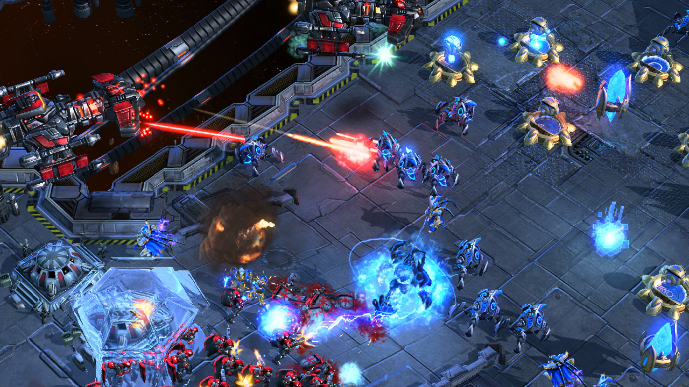
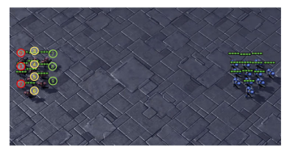
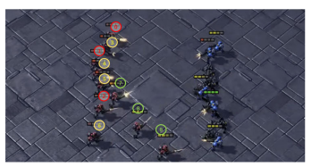

# Multi-agent deep reinforcement learning with type-based hierarchical group communication

# Preface 
Here, I have implemented THGC(Type Based Heirarchial for Group Communication netwroks) in StarCraft II environment. I have used this environment along with <a src= "https://github.com/oxwhirl/pymarl">PyMARL</a>. More detail about this is given below.<br><br>


<br>
<br>

```diff
- Please pay attention to the version of SC2 you are using for your experiments. 
- Performance is *not* always comparable between versions. 
- The results in SMAC (https://arxiv.org/abs/1902.04043) use SC2.4.6.2.69232 not SC2.4.10.
```
<br>
# **To run it do the SAME thing as did to run CARLA from colab**

# Python MARL framework

PyMARL is [WhiRL](http://whirl.cs.ox.ac.uk)'s framework for deep multi-agent reinforcement learning and includes implementations of the following algorithms:
- [**QMIX**: QMIX: Monotonic Value Function Factorisation for Deep Multi-Agent Reinforcement Learning](https://arxiv.org/abs/1803.11485)
- [**COMA**: Counterfactual Multi-Agent Policy Gradients](https://arxiv.org/abs/1705.08926)
- [**VDN**: Value-Decomposition Networks For Cooperative Multi-Agent Learning](https://arxiv.org/abs/1706.05296) 
- [**IQL**: Independent Q-Learning](https://arxiv.org/abs/1511.08779)
- [**QTRAN**: QTRAN: Learning to Factorize with Transformation for Cooperative Multi-Agent Reinforcement Learning](https://arxiv.org/abs/1905.05408)
- [**THGC**: THGC: Multi-agent deep reinforcement learning with type-based hierarchical group communication](https://www.researchgate.net/publication/348552575_Multi-agent_deep_reinforcement_learning_with_type-based_hierarchical_group_communication)

PyMARL is written in PyTorch and uses [SMAC](https://github.com/oxwhirl/smac) as its environment.

## THGC Algorithm

<h3>Model Architectures :</h3>


<p align="center">In the above shown figure we have the THGC network architecture.</p>

<h3>Agent Grouping :</h3>

Here, we have grouped the allies by two methods as shown in figures. One is groupinf on basis of location and another is grouping on basis of health.<br>
<ol>
  <li><B>On basis of health </B>: In this we basically grouped the allies who were having normalised health differences in between 0 to 0.3. The noramlised health is foud the (agent_health) / (agent_max_health). This type of group helps us in combining the strngth of our army together get more commulative reward.</li>
  <li><B>On basis of location </B>: In this grouping takes place if the agents are in a distance of 0.5 units. This not only improves the communication but also helps in improving quick group actions.</li>
</ol>

      <br>

<h4>Types of Agents</h4>
Here, we have a default agent (rnn agent) and other it thgc agent, which is specifically designed for this project. 
<h3>Communication or Knoweldege share via Graph Attention Netowrks:</h3>

For, commication we have used Graph Attention Networks (<a href="https://arxiv.org/abs/1710.10903">GAT</a>). The GAT netwroks are for communication between the agents of a group (intra level) and for inter group communication.
 
<h4>Adjacency Matrix:</h4>

The adjacency matrix is basically a boolen matrix which tells whether the ally is near a range of communication or not (specifically 0.5). The threshold of including the nodes in the Graph attention vertex is 0.5. The main reason for this was, if agent were far enough, then we don't need communication with them as it will lead to noise or unnecessary data collection, which is not so beneficial and will affect the performance of agents in a group. 
Specifically for grouing, we have used some heuristics to get the commincation on basis of latest data from the env.

## Installation instructions

Build the Dockerfile using 
```shell
cd docker
bash build.sh
```

Set up StarCraft II and SMAC:
```shell
bash install_sc2.sh
```

This will download SC2 into the 3rdparty folder and copy the maps necessary to run over.

The requirements.txt file can be used to install the necessary packages into a virtual environment (not recomended).

## Run an experiment 

```shell
python3 src/main.py --config=thgc --env-config=sc2 with env_args.map_name=2s3z
```

The config files act as defaults for an algorithm or environment. 

They are all located in `src/config`.
`--config` refers to the config files in `src/config/algs`
`--env-config` refers to the config files in `src/config/envs`

To run experiments using the Docker container:
```shell
bash run.sh $GPU python3 src/main.py --config=qmix --env-config=sc2 with env_args.map_name=2s3z
```

All results will be stored in the `Results` folder.

The previous config files used for the SMAC Beta have the suffix `_beta`.

## Saving and loading learnt models

### Saving models

You can save the learnt models to disk by setting `save_model = True`, which is set to `False` by default. The frequency of saving models can be adjusted using `save_model_interval` configuration. Models will be saved in the result directory, under the folder called *models*. The directory corresponding each run will contain models saved throughout the experiment, each within a folder corresponding to the number of timesteps passed since starting the learning process.

### Loading models

Learnt models can be loaded using the `checkpoint_path` parameter, after which the learning will proceed from the corresponding timestep. 

## Watching StarCraft II replays

`save_replay` option allows saving replays of models which are loaded using `checkpoint_path`. Once the model is successfully loaded, `test_nepisode` number of episodes are run on the test mode and a .SC2Replay file is saved in the Replay directory of StarCraft II. Please make sure to use the episode runner if you wish to save a replay, i.e., `runner=episode`. The name of the saved replay file starts with the given `env_args.save_replay_prefix` (map_name if empty), followed by the current timestamp. 

The saved replays can be watched by double-clicking on them or using the following command:

```shell
python -m pysc2.bin.play --norender --rgb_minimap_size 0 --replay NAME.SC2Replay
```

**Note:** Replays cannot be watched using the Linux version of StarCraft II. Please use either the Mac or Windows version of the StarCraft II client.

## Documentation/Support

Documentation is a little sparse at the moment (but will improve!). Please raise an issue in this repo, or email [Tabish](mailto:tabish.rashid@cs.ox.ac.uk)

## Citing PyMARL 

If you use PyMARL in your research, please cite the [SMAC paper](https://arxiv.org/abs/1902.04043).

*M. Samvelyan, T. Rashid, C. Schroeder de Witt, G. Farquhar, N. Nardelli, T.G.J. Rudner, C.-M. Hung, P.H.S. Torr, J. Foerster, S. Whiteson. The StarCraft Multi-Agent Challenge, CoRR abs/1902.04043, 2019.*

In BibTeX format:

```tex
@article{samvelyan19smac,
  title = {{The} {StarCraft} {Multi}-{Agent} {Challenge}},
  author = {Mikayel Samvelyan and Tabish Rashid and Christian Schroeder de Witt and Gregory Farquhar and Nantas Nardelli and Tim G. J. Rudner and Chia-Man Hung and Philiph H. S. Torr and Jakob Foerster and Shimon Whiteson},
  journal = {CoRR},
  volume = {abs/1902.04043},
  year = {2019},
}
```

## License

Code licensed under the Apache License v2.0
