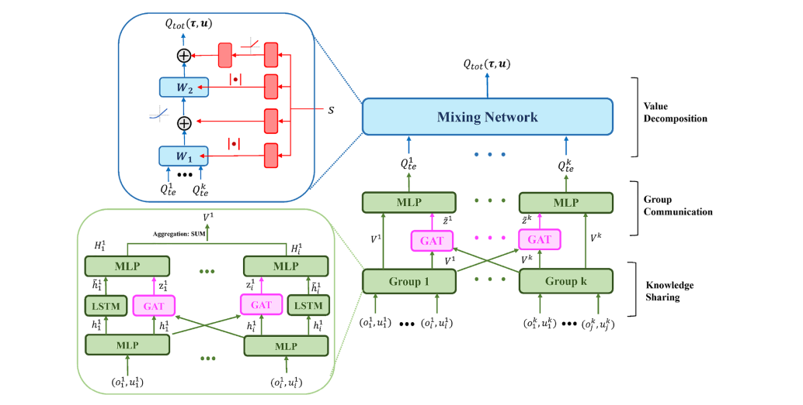

# Heirarchial_RL_implementation
# Apply it to starcraft env

# take help from here, to know how to implement.  https://github.com/oxwhirl/pymarl

Make this project priority for now. 

Connect this to MultiAgent and then do the task

See github repos for implementing LSTMs and GAT
https://github.com/PetarV-/GAT
# Not much work required just do some changes in the algorithm used in PyMARL. 
# just search on internet with Multi agent RL with herirachial RL and with this use the key words suggested by google 
Tonnes of projects are there.

